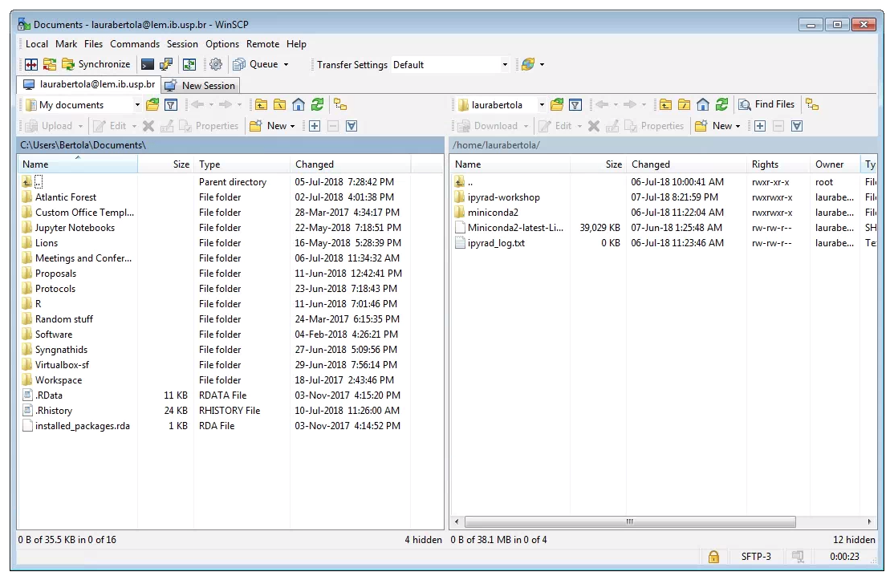
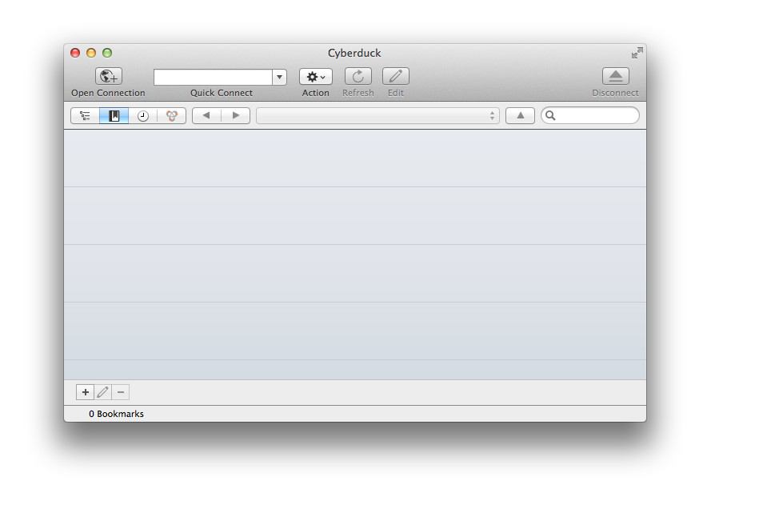
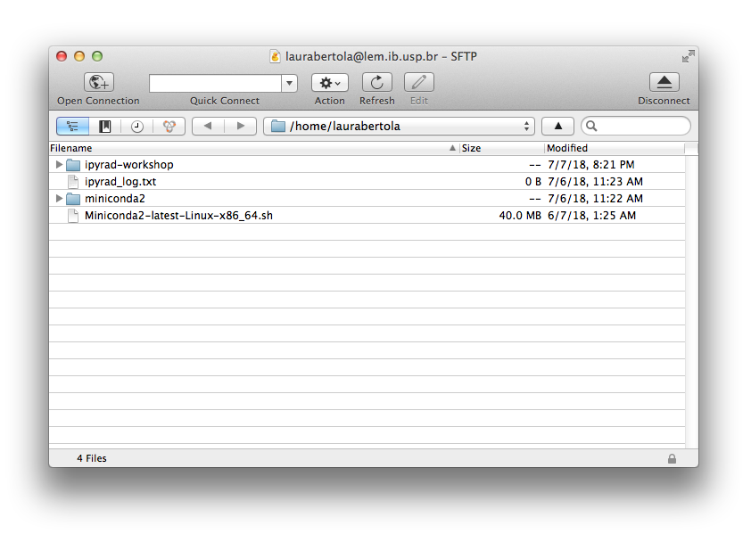
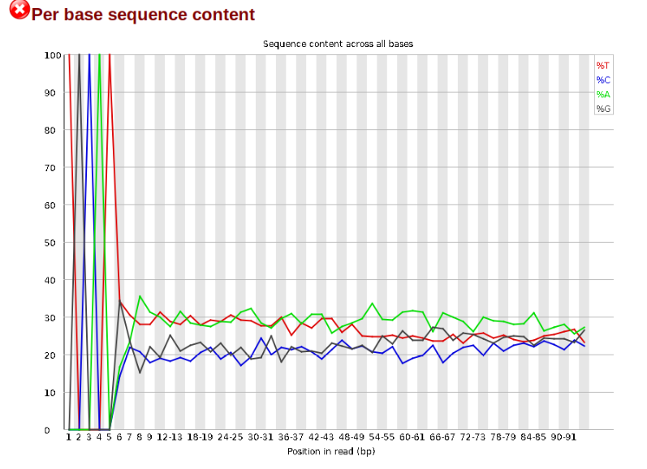

# Cluster Basics and Housekeeping
The bulk of the activities this morning involve getting oriented on the cluster and getting programs and resources set up for the actual assembly and analysis. We make no assumptions about prior experience with cluster environments, so we scaffold the entire participant workshop experience from first principles. More advanced users hopefully will find value in some of the finer details we present.

* [Connecting to the cluster](#ssh-intro): [Windows](#ssh-for-windows)/[Mac/Linux](#ssh-for-mac)
* [Basic command line navigation](#command-line-basics)
* [Setting up the computing environment](#download-and-install-software)
* [Fetching the data](#fetch-the-raw-data)
* [Basic quality control (FastQC)](#fastqc-for-quality-control)
* [Viewing and interpreting FAstQC results](#inspecting-fastqc-utput)

## Tutorial documentation conventions
Each grey cell in this tutorial indicates a command line interaction. Lines starting with $ indicate a command that should be executed in a terminal, for example by copying and pasting the text into your terminal. All lines in code cells beginning with ## are comments and should not be copied and executed. Elements in code cells surrounded by angle brackets (e.g. `<username>`) are variables that need to be replaced by the user. All other lines should be interpreted as output from the issued commands.

```
## Example Code Cell.
## Create an empty file in my home directory called `watdo.txt`
$ touch ~/watdo.txt

## Print "wat" to the screen
$ echo "wat"
wat
```

## USP Zoology HPC Facility Info
Computational resources for the duration of this workshop have been generously provided by the Zoology HPC facility, with special thanks to Diogo Melo for technical support and Roberta Damasceno for coordinating access. The cluster we will be using is located at `lem.ib.usp.br`. Further details about cluster resources and available queues can be found on the [USP Cluster Info](USP_Cluster_Info.md) page.

## SSH Intro
Unlike laptop or desktop computers, cluster systems typically (almost exclusively) do not have graphical user input interfaces. Interacting with an HPC system therefore requires use of the command line to establish a connection, and for running programs and submitting jobs remotely on the cluster.

### SSH for windows
Windows computers need to use a 3rd party app for connecting to remote computers. The best app for this in my experience is [puTTY](https://www.putty.org/), a free SSH client. Right click and "Save link as" on the [64-bit binary executable link](https://the.earth.li/~sgtatham/putty/latest/w64/putty.exe). 

After installing puTTY, open it and you will see a window where you can fill out the name or IP address of the computer or cluster you want to connect to (the 'host'). To connect to the cluster, enter: lem.ib.usp.br. Make sure that the port is set to 22. Click 'Open'. 


### SSH for mac/linux
Linux operating systems come preinstalled with an ssh command line client, which we will assume linux users are aware of how to use. Mac computers are built top of a linux-like operating system so they too ship with an SSH client, which can be accessed through the Terminal app. In a Finder window open Applications->Utilities->Terminal, then you can start an ssh session like this:

```
$ ssh <username>@lem.ib.usp.br
```

> **Note on usage:** In command line commands we'll use the convention of wrapping variable names in angle-brackets. For example, in the command above you should substitute your own username for `<username>`.

## Command line interface (CLI) basics
Put some stuff here about navigating the home directory, maybe mkdir, pwd, cd.

```
$ mkdir ipyrad-workshop
```
> **Special Note:** Notice that the above directory we are making is not called `ipyrad workshop`. This is **very important**, as spaces in directory names are known to cause havoc on HPC systems. All linux based operating systems do not recognize file or directory names that include spaces because spaces act as default delimiters between arguments to commands. There are ways around this (for example Mac OS has half-baked "spaces in file names" support) but it will be so much for the better to get in the habit now of *never including spaces in file or directory names*.

## Download and Install Software
### Install conda
[Conda](https://conda.io/docs/) is a command line software installation tool based on python. It will allow us to install and run various useful applications inside our home directory that we would otherwise have to hassle the HPC admins to install for us. Conda provides an isolated environment for each user, allowing us all to manage our own independent suites of applications, based on our own computing needs.

64-Bit Python2.7 conda installer for linux is here:[https://repo.continuum.io/miniconda/Miniconda2-latest-Linux-x86_64.sh](https://repo.continuum.io/miniconda/Miniconda2-latest-Linux-x86_64.sh), so copy and paste this link into the commands as below:

```
$ cd ~
$ wget https://repo.continuum.io/miniconda/Miniconda2-latest-Linux-x86_64.sh
```
> **Note:** The `~` in the `cd` command is a special character on linux systems that means "My Home Directory" (e.g. `/home/isaac`).

After the download finishes you can execute the conda installer: 

```
$ bash Miniconda2-latest-Linux-x86_64.sh
```
Accept the license terms, and use the default conda directory (mine is `/home/isaac/miniconda2`). After the install completes it will ask about modifying your PATH, and you should say 'yes' for this. Next run the following two commands:

```
$ source .bashrc
$ which python
/home/<username>/miniconda2/bin/python
```
The `source` command tells the server to recognize the conda install (you only ever have to do this once, so don't worry too much about remembering it). The `which` command will show you the path to the python binary, which will now be in your personal minconda directory:

### Install ipyrad and fastqc
Conda gives us access to an amazing array of all kinds of analysis tools for both analyzing and manipulating all kinds of data. Here we'll just scratch the surface by installing [ipyrad](http://ipyrad.readthedocs.io/), the RAD-Seq assembly and analysis tool that we'll use throughout the workshop, [FastQC](https://www.bioinformatics.babraham.ac.uk/projects/fastqc/), an application for filtering fasta files based on several quality control metrics. As long as we're installing conda packages we'll include [toytree](https://toytree.readthedocs.io/en/latest/) as well, which is a plotting library used by the ipyrad analysis toolkit.

```
$ conda install -c ipyrad -c bioconda ipyrad toytree fastqc
```
> **Note:** The `-c` flag indicates that we're asking conda to fetch apps from the `ipyrad`, `bioconda`, and `eaton-lab` channels. Channels are seperate repositories of apps maintained by independent developers.

After you type `y` to proceed with install, these commands will produce a lot of output that looks like this:
```
libxml2-2.9.8        |  2.0 MB | ################################################################################################################################# | 100%
expat-2.2.5          |  186 KB | ################################################################################################################################# | 100% 
singledispatch-3.4.0 |   15 KB | ################################################################################################################################# | 100%
pandocfilters-1.4.2  |   12 KB | ################################################################################################################################# | 100% 
pandoc-2.2.1         | 21.0 MB | ################################################################################################################################# | 100%
mistune-0.8.3        |  266 KB | ################################################################################################################################# | 100% 
send2trash-1.5.0     |   16 KB | ################################################################################################################################# | 100%
gstreamer-1.14.0     |  3.8 MB | ################################################################################################################################# | 100% 
qt-5.9.6             | 86.7 MB | ################################################################################################################################# | 100%
freetype-2.9.1       |  821 KB | ################################################################################################################################# | 100% 
wcwidth-0.1.7        |   25 KB | ################################################################################################################################# | 100%
```
These (and many more) are all the dependencies of ipyrad and fastqc. Dependencies can include libraries, frameworks, and/or other applications that we make use of in the architecture of our software. Conda knows all about which dependencies will be needed and installs them automatically for you. Once the process is complete (may take several minutes), you can verify the install by asking what version of each of these apps is now available for you on the cluster.

```
$ ipyrad --version
ipyrad 0.7.28
$ fastqc --version
FastQC v0.11.7
```
## Fetch the raw data
We will be reanalysing RAD-Seq data from *Anolis punctatus* sampled from across their distribution on the South American continent and published in [Prates *et al.* 2016](http://www.pnas.org/content/pnas/113/29/7978.full.pdf). The original dataset included 43 individuals of *A. punctatus*, utilized the Genotyping-By-Sequencing (GBS) single-enzyme library prep protocol [Ellshire *et al.* 2011](http://journals.plos.org/plosone/article?id=10.1371/journal.pone.0019379), sequenced 100bp single-end reads on an Illumina Hi-Seq and resulted in final raw sequence counts on the order of 1e6 per sample.

We will be using a subset of 10 individuals distributed along the coastal extent of the central and northern Atlantic forest. Additionally, raw reads have been randomly downsampled to 2.5e5 per sample, in order to create a dataset that will be computationally tractable for 20 people to run simultaneously with the expectation of finishing in a reasonable time.

The subset of truncated raw data is located in a special folder on the HPC system. You can *change directory* into your ipyrad working directory, and then copy the raw data with these commands:
```
$ cd ipyrad-workshop
$ cp /scratch/af-biota/raw_data/a_punctatus.tgz .
```
> **Note:** The form of the copy command is `copy <source> <destination>`. Here the source file is clear, it's simply the data file you want to copy. The destination is `.`, which is another linux shortcut that means "My current directory", or "Right here in the directory I'm in".

Finally, you'll notice the raw data is in `.tgz` format, which is similar to a zip archive. We can unpack our raw data in the current directory using the `tar` command:
```
$ tar -xvzf a_punctatus.tgz
```
> **Point of interest:** All linux commands, such as `tar`, can have their behavior modified by passing various arguments. Here the arguments are `-x` to "Extract" the archive file; `-v` to add "verbosity" by printing progress to the screen; `z` to "unzip" the archive during extraction; and `-f` to "force" the extraction which prevents `tar` from pestering you with decisions.

Now use `ls` to list the contents of your current directory, and also to list the contents of the newly created `raws` directory:
```
$ ls
a_punctatus.tgz  raws
$ ls raws/
punc_IBSPCRIB0361_R1_.fastq.gz  punc_JFT773_R1_.fastq.gz    punc_MTR17744_R1_.fastq.gz  punc_MTR34414_R1_.fastq.gz  punc_MTRX1478_R1_.fastq.gz
punc_ICST764_R1_.fastq.gz       punc_MTR05978_R1_.fastq.gz  punc_MTR21545_R1_.fastq.gz  punc_MTRX1468_R1_.fastq.gz  punc_MUFAL9635_R1_.fastq.gz
```

## FastQC for quality control
The first step of any RAD-Seq assembly is to inspect your raw data to estimate overall quality. At this stage you can then attempt to improve your dataset by identifying and removing samples with failed sequencing. Another key QC procedure involves inspecting average quality scores per base position and trimming read edges, which is where low quality base-calls tend to accumulate. In this figure, the X-axis shows the position on the read in base-pairs and the Y-axis depicts information about [Phred quality score](https://en.wikipedia.org/wiki/Phred_quality_score) per base for all reads, including median (center red line), IQR (yellow box), and 10%-90% (whiskers). As an example, here is a very clean base sequence quality report for a 75bp RAD-Seq library. These reads have generally high quality across their entire length, with only a slight (barely worth mentioning) dip toward the end of the reads:


In contrast, here is a somewhat typical base sequence quality report for R1 of a 300bp paired-end Illumina run of ezrad data:


This figure depicts a common artifact of current Illumina chemistry, whereby quality scores per base drop off precipitously toward the ends of reads, with the effect being magnified for read lengths > 150bp. The purpose of using FastQC to examine reads is to determine whether and how much to trim our reads to reduce sequencing error interfering with basecalling. In the above figure, as in most real dataset, we can see there is a tradeoff between throwing out data to increase overall quality by trimming for shorter length, and retaining data to increase value obtained from sequencing with the result of increasing noise toward the ends of reads.

### Running FastQC on the Anolis data
In preparation for running FastQC on our raw data we need to make an output directory to keep the FastQC results organized:

```
$ cd ~/ipyrad-workshop
$ mkdir fastqc-results
```
Now run fastqc on one of the samples:
```
$ fastqc -o fastqc-results raws/punc_IBSPCRIB0361_R1_.fastq.gz
```
> **Note:** The `-o` flag tells fastqc where to write output files. **Especially Notice** the *relative path* to the raw file. The difference between *relative* and *absolute* paths is an important one to learn. Relative paths are specified with respect to the current working directory. Since I am in `/home/isaac/ipyrad-workshop`, and this is the directory the `raws` directory is in, I can simply reference it directly. If I was in any other directory I could specify the *absolute path* to the target fastq.gz file which would be `/home/isaac/ipyrad-workshop/raws/punc_IBSPCRIB0361_R1_.fastq.gz`. Absolute paths are always more precise, but also always (often _much_) longer.

FastQC will indicate its progress in the terminal. This toy data will run quite quickly, but real data can take somewhat longer to analyse (10s of minutes).
```
Started analysis of punc_IBSPCRIB0361_R1_.fastq.gz
Approx 5% complete for punc_IBSPCRIB0361_R1_.fastq.gz
Approx 10% complete for punc_IBSPCRIB0361_R1_.fastq.gz
Approx 15% complete for punc_IBSPCRIB0361_R1_.fastq.gz
Approx 20% complete for punc_IBSPCRIB0361_R1_.fastq.gz
Approx 25% complete for punc_IBSPCRIB0361_R1_.fastq.gz
Approx 30% complete for punc_IBSPCRIB0361_R1_.fastq.gz
Approx 35% complete for punc_IBSPCRIB0361_R1_.fastq.gz
Approx 40% complete for punc_IBSPCRIB0361_R1_.fastq.gz
Approx 45% complete for punc_IBSPCRIB0361_R1_.fastq.gz
Approx 50% complete for punc_IBSPCRIB0361_R1_.fastq.gz
Approx 55% complete for punc_IBSPCRIB0361_R1_.fastq.gz
Approx 60% complete for punc_IBSPCRIB0361_R1_.fastq.gz
Approx 65% complete for punc_IBSPCRIB0361_R1_.fastq.gz
Approx 70% complete for punc_IBSPCRIB0361_R1_.fastq.gz
Approx 75% complete for punc_IBSPCRIB0361_R1_.fastq.gz
Approx 80% complete for punc_IBSPCRIB0361_R1_.fastq.gz
Approx 85% complete for punc_IBSPCRIB0361_R1_.fastq.gz
Approx 90% complete for punc_IBSPCRIB0361_R1_.fastq.gz
Approx 95% complete for punc_IBSPCRIB0361_R1_.fastq.gz
Approx 100% complete for punc_IBSPCRIB0361_R1_.fastq.gz
Analysis complete for punc_IBSPCRIB0361_R1_.fastq.gz
```
If you feel so inclined you can QC all the raw data using a wildcard substitution:
```
$ fastqc -o fastqc-results raws/*
```
> **Note:** The `*` here is a special command line character that means "Everything that matches this pattern". So here `raws/*` matches _everything_ in the raws directory. Equivalent (though more verbose) statements are: `ls raws/*.gz`, `ls raws/*.fastq.gz`, `ls raws/*_R1_.fastq.gz`. All of these will list all the files in the `raws` directory. **Special Challenge:** Can you construct an `ls` command using wildcards that only lists samples in the `raws` directory that include the digit 5 in their sample name?

Examining the output directory you'll see something like this:
```
$ ls fastqc-results/
punc_IBSPCRIB0361_R1__fastqc.html  punc_JFT773_R1__fastqc.html    punc_MTR17744_R1__fastqc.html  punc_MTR34414_R1__fastqc.html  punc_MTRX1478_R1__fastqc.html
punc_IBSPCRIB0361_R1__fastqc.zip   punc_JFT773_R1__fastqc.zip     punc_MTR17744_R1__fastqc.zip   punc_MTR34414_R1__fastqc.zip   punc_MTRX1478_R1__fastqc.zip
punc_ICST764_R1__fastqc.html       punc_MTR05978_R1__fastqc.html  punc_MTR21545_R1__fastqc.html  punc_MTRX1468_R1__fastqc.html  punc_MUFAL9635_R1__fastqc.html
punc_ICST764_R1__fastqc.zip        punc_MTR05978_R1__fastqc.zip   punc_MTR21545_R1__fastqc.zip   punc_MTRX1468_R1__fastqc.zip   punc_MUFAL9635_R1__fastqc.zip
```

Now we have output files that include html and images depicting lots of information about the quality of our reads, but we can't inspect these because we only have a CLI interface on the cluster. How do we get access to the output of FastQC?

### Obtaining FastQC Output (sftp)

Moving files between the cluster and your local computer is a very common task, and this will typically be accomplished with a secure file transfer protocol (**sftp**) client. Various Free/Open Source GUI tools exist but we recommend [WinSCP](https://winscp.net/eng/download.php) for Windows and [Cyberduck](https://cyberduck.io/) for MacOS. 

**Windows:**
After downloading, installing, and opening WinSCP, you will see the following screen. First, ensure that the "File Protocol is set to "SFTP". **The connection will fail if "SFTP" is not chosen her.** Next, fill out the host name (`lem.ib.usp.br`), your username and password, and click "Login". 

Two windows file browsers will appear: your laptop on the left, and the cluster on the right. You can navigate through the folders and transfer files from the cluster to your laptop by dragging and dropping them. 


**Mac/Linux:**
After downloading, installing and opening Cyberduck, you will see the following screen:


Click on "Open Connection" (top left), and a new screen will open. First, make sure you select "SFTP (SSH File Transfer Protocol)" in the dropdown menu at the top of the box. **The connection will fail if "SFTP" is not selected here.** If "SFTP" is properly selected the "Port:" will automatically be set to 22. Next, fill out the host name (`lem.ib.usp.br`), your username and password, and click "Connect".

Now, you should see a screen with your home directory on the cluster. You can navigate through your files here, and download them to your laptop.


### Instpecting and Interpreting FastQC Output

Just taking a random one, lets spend a moment looking at the results from `punc_JFT773_R1__fastqc.html`. Opening up this html file, on the left you'll see a summary of all the results, which highlights areas FastQC indicates may be worth further examination. We will only look at a few of these.


Lets start with Per base sequence quality, because it's very easy to interpret, and often times with RAD-Seq data results here will be of special importance.


For the Anolis data the sequence quality per base is uniformly quite high, with dips only in the first and last 5 bases (again, this is typical for Illumina reads). Based on information from this plot we can see that the Anolis data doesn't need a whole lot of trimming, which is good.

Now lets look at the `Per base sequece content`, which FastQC highlights with a scary red **X**.


The squiggles indicate base composition per base position averaged across the reads. It looks like the signal FastQC is concerned about here is related to the *extreme* base composition bias of the first 5 positions. We happen to know this is a result of the restriction enzyme overhang present in all reads (`TGCAT` in this case for the EcoT22I enzyme used), and so it is in fact of no concern. Now lets look at `Adapter Content`:


Here we can see adapter contamination increases toward the tail of the reads, approaching 40% of total read content at the very end. The concern here is that if adapters represent some significant fraction of the read pool, then they will be treated as "real" data, and potentially bias downstream analysis. In the Anolis data this looks like it might be a real concern so we shall keep this in mind during step 2 of the ipyrad analysis, and incorporate 3' read trimming and aggressive adapter filtering.

Other than this, the data look good and we can proceed with the ipyrad analysis.

# References
Elshire, R. J., Glaubitz, J. C., Sun, Q., Poland, J. A., Kawamoto, K., Buckler, E. S., & Mitchell, S. E. (2011). A robust, simple genotyping-by-sequencing (GBS) approach for high diversity species. PloS one, 6(5), e19379.

Prates, I., Xue, A. T., Brown, J. L., Alvarado-Serrano, D. F., Rodrigues, M. T., Hickerson, M. J., & Carnaval, A. C. (2016). Inferring responses to climate dynamics from historical demography in neotropical forest lizards. Proceedings of the National Academy of Sciences, 113(29), 7978-7985.
