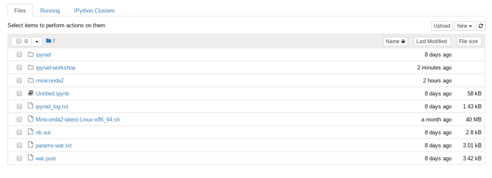
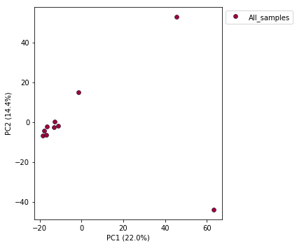
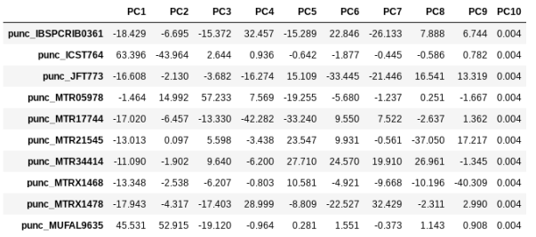
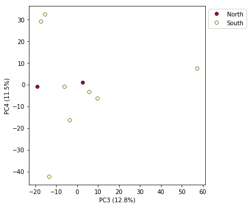
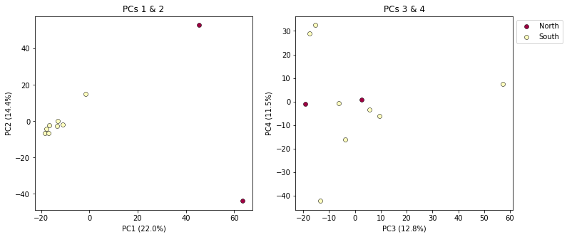

# The ipyrad.analysis module: **PCA**

As part of the `ipyrad.analysis` toolkit we've created convenience functions for easily performing exploratory principal component analysis (PCA) on your data. PCA is a very standard dimension-reduction technique that is often used to get a general sense of how samples are related to one another. PCA has the advantage over STRUCTURE type analyses in that it is very fast. Similar to STRUCTURE, PCA can be used to produce simple and intuitive plots that can be used to guide downstream analysis. These are three very nice papers that talk about the application and interpretation of PCA in the context of population genetics:

* [Reich et al (2008) Principal component analysis of genetic data](https://www.nature.com/articles/ng0508-491)
* [Novembre & Stephens (2008) Interpreting principal component analyses of spatial population genetic variation](https://www.nature.com/articles/ng.139)
* [McVean (2009) A genealogical interpretation of principal components analysis](http://journals.plos.org/plosgenetics/article?id=10.1371/journal.pgen.1000686)

## A note on Jupyter/IPython
[Jupyter notebooks](http://jupyter.org/) are primarily a way to generate reproducible scientific analysis workflows in python. ipyrad analysis tools are best run inside Jupyter notebooks, as the analysis can be monitored and tweaked and provides a self-documenting workflow.

First begin by [setting up and configuring jupyter notebooks](Jupyter_Notebook_Setup.md). **The rest of the materials in this part of the workshop assume you are running all code in cells of a jupyter notebook** that is running on the USP cluster.

# **PCA** analyses

* [Simple PCA from a VCF file](#simple-pca-from-vcf-file)
* [Coloring by population assignment](#population-assignment-for-sample-colors)
* [Removing "bad" samples and replotting](#removing-bad-samples-and-replotting)
* [Specifying which PCs to plot](#looking-at-pcs-other-than-1--2)
* [Multi-panel PCA](#multi-panel-pca)
* [More to explore](#more-to-explore)

## Create a new notebook for the PCA
On your local computer open a new web browser and enter the link to your notebook server in the address bar (including your assigned port number from the [participants port #s page](participants.txt)):
```
http://localhost:<my_port_#>
```
Now you should see a view of your home directory on the cluster:


Lets go inside the ipyrad-workshop folder and create our first new notebook using the 'New' button, then 'Python 2' button.


First things first, rename your new notebook to give it a meaningful name:


### Import Python libraries
The `import` keyword directs python to load a module into the currently running context. This is very similar to the `library()` function in R. We begin by importing ipyrad, as well as the analysis module. 

```python
%matplotlib inline
import ipyrad
import ipyrad.analysis as ipa      ## ipyrad analysis toolkit
```
> **Note:** The call to `%matplotlib inline` here is a jupyter notebook 'magic' command that enables support for plotting directly inside the notebook.

## Quick guide (tl;dr)
The following cell shows the quickest way to results using a small simulated dataset in `/scratch/af-biota`. Complete explanation of all of the features and options of the PCA module is the focus of the rest of this tutorial. Copy this code into a notebook cell and run it.

```python
## Load your assembly
data = ipyrad.load_json("/scratch/af-biota/simulated-example/simrad.json")
## Create the pca object
pca = ipa.pca(data)
## Bam!
pca.plot()
```
    loading Assembly: simrad
    from saved path: /scratch/af-biota/simulated-example/simrad.json
    <matplotlib.axes._subplots.AxesSubplot at 0x7fb6fdf82050>


> **Note** Obviously you want to replace "My Title" and "My_PCA_plot.png" with something more meaningful.

## Full guide

### Simple pca from vcf file

In the most common use, you'll want to plot the first two PCs, then inspect the output, remove any obvious outliers, and then redo the pca. It's often desirable to import a vcf file directly rather than to use the ipyrad assembly, so here we'll demonstrate this with the Anolis data.

```python
## Path to the input vcf.
vcffile = "/home/<username>/ipyrad-workshop/anolis_outfiles/anolis.vcf"
pca = ipa.pca(vcffile)
```
> **Note:** Here we use the anolis vcf generated with ipyrad, but the `ipyrad.analysis.pca` module can read in from *any* vcf file, so it's possible to quickly generate PCA plots for any vcf from any dataset.

We can inspect the samples included in the PCA plot by asking the `pca` object for `samples_vcforder`.
```python
print(pca.samples_vcforder)
```
    [u'punc_IBSPCRIB0361' u'punc_ICST764' u'punc_JFT773' u'punc_MTR05978'
     u'punc_MTR17744' u'punc_MTR21545' u'punc_MTR34414' u'punc_MTRX1468'
     u'punc_MTRX1478' u'punc_MUFAL9635']

Now construct the default plot, which shows all samples and PCs 1 and 2.
By default all samples are assigned to one population, so everything will 
be the same color.

```python
pca.plot()
```
    <matplotlib.axes._subplots.AxesSubplot at 0x7fe0beb3a650>



### Population assignment for sample colors
In the tl;dr example the assembly of our simulated data had included a `pop_assign_file` so the pca() was smart enough to find this and color samples accordingly. In some cases you might not have used a population assignment file, so it's also possible to specify population assignments in a dictionary. The format of the dictionary should have populations as keys and lists of samples as values. Sample names need to be identical to the names in the vcf file, which we can verify with the `samples_vcforder` property of the pca object.

Here we create a python 'dictionary', which is a key/value pair data structure. The keys are the population names, and the values are the lists of samples that belong to those populations. You can copy and paste this into a new cell in your notebook.
```python
pops_dict = {
     "South":['punc_IBSPCRIB0361', 'punc_MTR05978','punc_MTR21545','punc_JFT773',
             'punc_MTR17744', 'punc_MTR34414', 'punc_MTRX1478', 'punc_MTRX1468'],
     "North":['punc_ICST764', 'punc_MUFAL9635']
}
```
Now create the `pca` object with the vcf file again, this time passing 
in the pops_dict as the second argument, and plot the new figure. We can 
also easily add a title to our pca plots with the `title=` argument.
```python
pca = ipa.pca(vcffile, pops_dict)
pca.plot(title="Anolis Colored By Population")
```
    <matplotlib.axes._subplots.AxesSubplot at 0x7fe092fbbe50>


This is just much nicer looking now, and it's also much more straightforward to interpret.

## Removing "bad" samples and replotting.
In PC analysis, it's common for "bad" samples to dominate several of the first PCs, and thus "pop out" in a degenerate looking way. Bad samples of this kind can often be attributed to poor sequence quality or sample misidentifcation. Samples with lots of missing data tend to pop way out on their own, causing distortion in the signal in the PCs. Normally it's best to evaluate the quality of the sample, and if it can be seen to be of poor quality, to remove it and replot the PCA. The Anolis dataset is actually relatively nice, but for the sake of demonstration lets imagine the "North" samples are "bad samples".

From the figure we can see that we can see that "North" samples are distinguished by positive values on PC1. 

We can get a more quantitative view on this by accessing `pca.pcs`, which is a property of the `pca` object that is populated after the plot() function is called. It contains the first 10 PCs for each sample. Let's have a look at these values by printing `pca.pcs`:

```python
## Saving the PCs table to a .csv file
pca.pcs.to_csv("Anolis_10PCs.csv")

## Printing PCs to the screen
pca.pcs
```
> **Note** It's always good practice to use informative file names, f.e. here we use the name of the dataset and the number of PCs retained.



You can see that indeed punc_ICST764 and punc_MUFAL9635 have positive values for PC1 and all the rest have negative values, so we can target them for removal in this way. We can construct a 'mask' based on the value of PC1, and then remove samples that don't pass this filter.

```python
mask = pca.pcs.values[:, 0] > 0
print(mask)
```
    [False  True False False False False False False False  True]

> **Note:** In this call we are "masking" all samples (i.e. rows of the data matrix) which have values greater than 0 for the first column, which here is the '0' in the `[:, 0]` fragment. This is somewhat confusing because python matrices are 0-indexed, whereas it's typical for PCs to be 1-indexed. It's a nomencalture issue, really, but it can bite us if we don't keep it in mind. 

You can see above that the mask is a list of booleans that is the same length as the number of samples. We can use this mask to  print out the names of just the samples we would like to remove.

```python
bad_samples = pca.samples_vcforder[mask]
bad_samples
```
    array([u'punc_ICST764', u'punc_MUFAL9635'], dtype=object)

We can then use this list of "bad" samples in a call to `pca.remove_samples` and then replot the new pca:

```python
pca.remove_samples(bad_samples)
```
> **Note:** The `remove_samples` function is destructive of the samples in the `pca` object. This means that the removed samples are actually deleted from the `pca`, so if you want to get them back you have to reload the original vcf data.
```
## Lets prove that the removed smamples are gone now
print(pca.samples_vcforder)
```
      Number of PCs may not exceed the number of samples.
      Setting number of PCs = 8
    [u'punc_IBSPCRIB0361' u'punc_JFT773' u'punc_MTR05978' u'punc_MTR17744'
     u'punc_MTR21545' u'punc_MTR34414' u'punc_MTRX1468' u'punc_MTRX1478']
     
> **Note:** The number of PCs may not exceed the number of samples in the dataset. The `pca` module detects this and automatically reduces the number of PCs calculated.

And now plot the new figure with the "bad" samples removed. We also introduce another nice feature of the `pca.plot()` function, which is the `outfile` argument. This argument will cause the plot function to not only draw to the screen, but also to save a `png` formatted file to the filesystem.
```python
pca.plot(title="Anolis w/o Northern Samples", outfile="Anolis_no_north.png")
```
    <matplotlib.axes._subplots.AxesSubplot at 0x7fe0f8c25410>
> **Note:** Spaces in filenames are ***BAD***. It's good practice, as we demonstrate here, to always substitute underscores (`_`) for spaces in filenames.


## Looking at PCs other than 1 & 2
PCs 1 and 2 by definition explain the most variation in the data, but sometimes PCs further down the chain can also be useful and informative. The plot function makes it simple to ask for PCs directly.

```python
## Lets reload the full dataset so we have all the samples
pca = ipa.pca(vcffile, pops_dict)
pca.plot(pcs=[3,4])
```
    <matplotlib.axes._subplots.AxesSubplot at 0x7fa3d05fd190>



## Multi-panel PCA
This is a last example of a couple of the nice features of the `pca` module, including the ability to pass in the axis to draw to, and toggling the legend. First, lets say we want to look at PCs 1/2 and 3/4 simultaneously. We can create a multi-panel figure with matplotlib, and pas in the axis for `pca` to plot to. We won't linger on the details of the matplotlib calls, but illustrate this here so you might have some example code to use in the future.
```python
import matplotlib.pyplot as plt

## Create a new figure 12 inches wide by 5 inches high
fig = plt.figure(figsize=(12, 5))

## These two calls divide the figure evenly into left and right
## halfs, and assigns the left half to `ax1` and the right half to `ax2`
ax1 = fig.add_subplot(1, 2, 1)
ax2 = fig.add_subplot(1, 2, 2)

## Plot PCs 1 & 2 on the left half of the figure, and PCs 3 & 4 on the right
pca.plot(ax=ax1, pcs=[1, 2], title="PCs 1 & 2")
pca.plot(ax=ax2, pcs=[3, 4], title="PCs 3 & 4")

## Saving the plot as a .png file
plt.savefig("Anolis_2panel_PCs1-4.png", bbox_inches="tight")
```
    <matplotlib.axes._subplots.AxesSubplot at 0x7fa3d0a04290>

> **Note** Saving the two panel figure is a little different, because we're making
a composite of two different PCA plots. We need to use the native matplotlib
`savefig()` function, to save the entire figure, not just one panel. `bbox_inches`
is an argument that makes the output figure look nicer, it crops the bounding box
more accurately.


It's nice to see PCs 1-4 here, but it's kind of stupid to plot the legend twice, so we can just turn off the legend on the first plot.

```python
fig = plt.figure(figsize=(12, 5))
ax1 = fig.add_subplot(1, 2, 1)
ax2 = fig.add_subplot(1, 2, 2)

## The difference here is we switch off the legend on the first PCA
pca.plot(ax=ax1, pcs=[1, 2], title="PCs 1 & 2", legend=False)
pca.plot(ax=ax2, pcs=[3, 4], title="PCs 3 & 4")

## And save the plot as .png
plt.savefig("My_PCA_plot_axis1-4.png", bbox_inches="tight")
```
    <matplotlib.axes._subplots.AxesSubplot at 0x7fa3d0a8db10>



Much better!

## More to explore
The `ipyrad.analysis.pca` module has many more features that we just don't have time to go over, but you might be interested in checking them out later:
* [Fine grained control of colors per populations](PCA_Advanced_Features.md#controlling-colors)
* [Dealing with missing data](PCA_Advanced_Features.md#dealing-with-missing-data)
* [Dealing with unequal sampling](PCA_Advanced_Features.md#dealing-with-unequal-sampling)
* [Dealing with linked snps](PCA_Advanced_Features.md#dealing-with-linked-snps)
