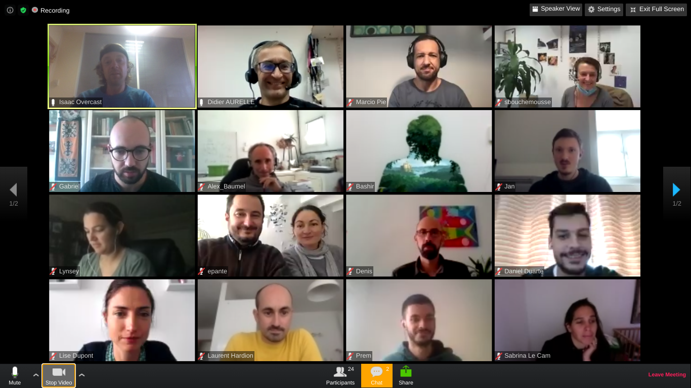
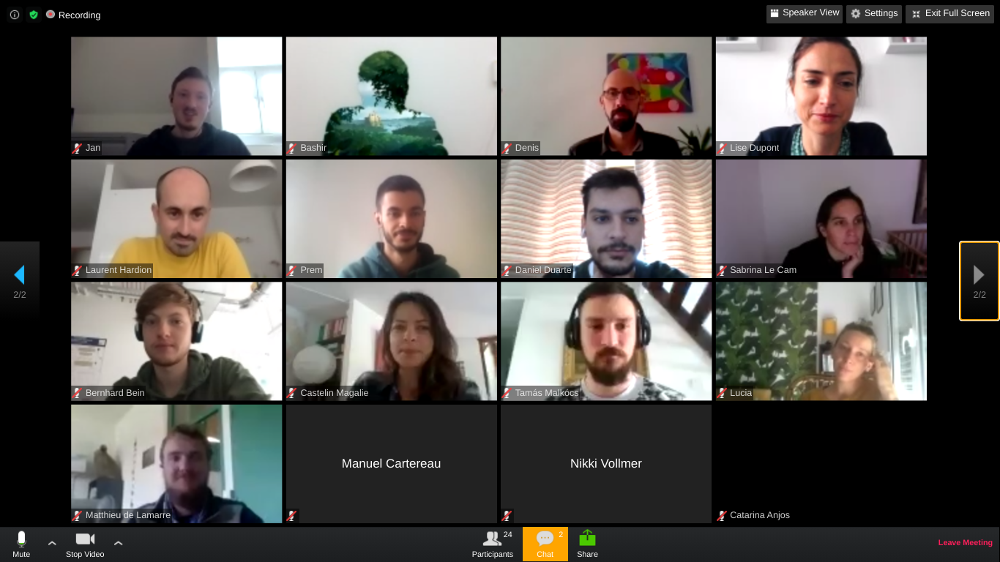

# Welcome to RadCamp 2020 - The Marseille Edition

October 5-7, 2020  
Location: Online (But spiritually in Marseille, France)

# Online content
To facilitate participation by people who may be subject to travel
restrictions we will provide a Zoom feed of the instruction, with access
to the chat channel for participating in the discussion. Link to come.

# Organisers, Instructors, and Facilitators

  - Didier Aurelle (Aix-Marseille Université/Mediterranean Institute of Oceanography)
  - Alex Baumel (Institut Méditerranéen de Biodiversité et d'Ecologie marine et continent)
  - Joana Boavida (CCMAR Center of Marine Sciences (Portugal))
  - Isaac Overcast (Institut de Biologie de l'Ecole Normale Superieure)
  - Eric Pante (La Rochelle Université)

# Binder link
[Launch a binder instance](https://mybinder.org/v2/gh/dereneaton/ipyrad/master)

* Get a New>Terminal and execute these commands (takes ~5 minutes):

```bash
$ wget https://radcamp.github.io/Marseille2020/binder-reinstall.sh
$ bash binder-reinstall.sh
```

# Schedule

__NB:__ All times are CEST (UTC+2)

Times           | Oct 5 | Oct 6 | Oct 7 |
-----           | ------ | ------ | ------ |
11:00-12:00       | [Introductions/Participant slides](https://docs.google.com/presentation/d/1kcjUdyS8BeLBjIdN6SLW9mMeByIWJ_5K5dRwYr5kUyE/edit?usp=sharing) | N/A | N/A |
14:00-15:20      | [Opening Remarks](https://amubox.univ-amu.fr/apps/onlyoffice/s/KGRP7aSKymXPASf), [Setup/Data QC](RADCamp-Day1-AM.md) & [ipyrad CLI Part 1](02_ipyrad_partI_CLI.html) | [Jupyter notebook intro](Jupyter_Notebook_Setup.html) & [ipyrad.analysis api for phylogenetic inference (RAxML)](RAxML_API.md) | [Assembing and using RAD locus catalogs: exploring the parameter space](Pante_intro_slide.pdf), [Running ipyrad on HPC](ipyrad_HPC_setup.md) & other optional analysis cookbooks |
15:20-15:30      | Break | Break | Break |
15:30-17:00       | [ipyrad CLI Part 2](03_ipyrad_partII_CLI.md) | [ipyrad.analysis api for population genetic inference (PCA)](PCA_API.md) | Assisted work session |

### Workshop sponsors
This session is funded by the Eccorev Research Federation, the Environmental
Genomics Research Group, the IMBE laboratory and the Aix-Marseille University.

## Additional ipyrad analysis cookbooks
* [Tetrad - A Quartet-based species tree method](https://nbviewer.jupyter.org/github/dereneaton/ipyrad/blob/master/tests/cookbook-tetrad.ipynb)
* [Phylogenetic inference: RAxML](06_RAxML_API.md)
* [Demographic analysis: momi2](07_momi2_API.md)
* [Clustering analysis: STRUCTURE](05_STRUCTURE_API.md)
* [BPP - Bayesian inference under a multi-species coalescent model](https://nbviewer.jupyter.org/github/dereneaton/ipyrad/blob/master/tests/cookbook-bpp-species-delimitation.ipynb)
* [Bucky - Phylogenetic concordance analysis](https://nbviewer.jupyter.org/github/dereneaton/ipyrad/blob/master/tests/cookbook-bucky.ipynb)
* [ABBA-BABA - Admixture analysis](https://nbviewer.jupyter.org/github/dereneaton/ipyrad/blob/master/tests/cookbook-abba-baba.ipynb)

# RADCamp Marseilles 2020 Group Photo



## Acknowledgements
RADCamp Marseilles 2020 materials are largely based on materials from previous
realizations of the workshop which included important contributions from:
* Deren Eaton
* Mariana Vasconcellos
* Laura Bertola
* Sandra Hoffberg
* Natalia Vasquez
* Francisco Pina Martins
