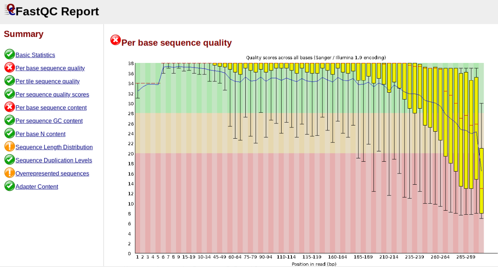
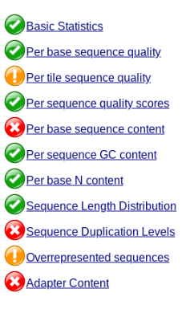
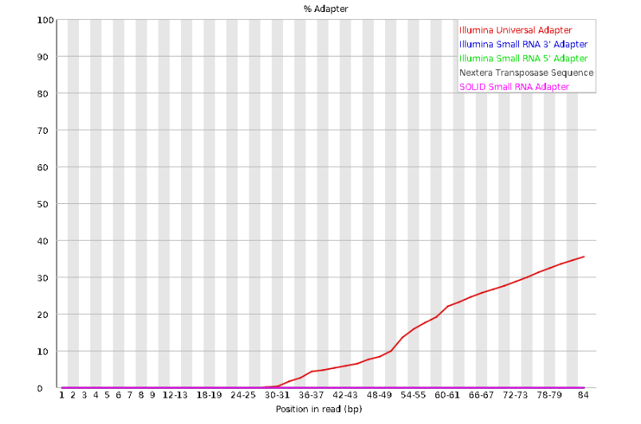

## FastQC for quality control

To get a better view of the data quality, without looking at individual reads,
we use automated approaches to check the quality. We will use
[FastQC](https://www.bioinformatics.babraham.ac.uk/projects/fastqc/) to generate a sample-wide
summary of data quality.

The logic of FastQC is that we want to obtain a high-level view of the quality
of the sequencing. You may be able to detect low quality samples, but if you
have a *lot* of samples, you may not want to run FastQC for every single file.
Even running it for a few samples will give you good insight into overall quality
of the sequencing run. For example, a key QC procedure involves inspecting average
quality scores per base position and trimming read edges, which is where low
quality base-calls tend to accumulate. In this figure, the X-axis shows the
position on the read in base-pairs and the Y-axis depicts information about
[Phred quality score](https://en.wikipedia.org/wiki/Phred_quality_score)
per base for all reads, including median (center red line), IQR (yellow box),
and 10%-90% (whiskers). As an example, here is a very clean base sequence
quality report for a 75bp RAD-Seq library. These reads have generally high
quality across their entire length, with only a slight (barely worth
mentioning) dip toward the end of the reads:


In contrast, here is a somewhat typical base sequence quality report for R1 of
a 300bp paired-end Illumina run of ezRAD data:



This figure depicts a common artifact of current Illumina chemistry, whereby
quality scores per base drop off precipitously toward the ends of reads, with
the effect being magnified for read lengths > 150bp. The purpose of using
FastQC to examine reads is to determine whether and how much to trim our reads
to reduce sequencing error interfering with basecalling. In the above figure,
as in most real dataset, we can see there is a tradeoff between throwing out
data to increase overall quality by trimming for shorter length, and retaining
data to increase value obtained from sequencing with the result of increasing
noise toward the ends of reads.

First, install FastQC:
```bash
$ conda install -c bioconda fastqc
```
Type 'y' when it asks you if you would like to install other packages ('Proceed ([y]/n)?')

Now run FastQC on this sample:
```bash
$ fastqc anolis_R1_.fastq.gz
```

FastQC will indicate its progress in the terminal. This toy data will run quite
quickly, but real data can take somewhat longer to analyse (10s of minutes).
```
Started analysis of anolis_R1_.fastq.gz
Approx 5% complete for anolis_R1_.fastq.gz
Approx 10% complete for anolis_R1_.fastq.gz
Approx 15% complete for anolis_R1_.fastq.gz
Approx 20% complete for anolis_R1_.fastq.gz
Approx 25% complete for anolis_R1_.fastq.gz
Approx 30% complete for anolis_R1_.fastq.gz
Approx 35% complete for anolis_R1_.fastq.gz
Approx 40% complete for anolis_R1_.fastq.gz
Approx 45% complete for anolis_R1_.fastq.gz
Approx 50% complete for anolis_R1_.fastq.gz
Approx 55% complete for anolis_R1_.fastq.gz
Approx 60% complete for anolis_R1_.fastq.gz
Approx 65% complete for anolis_R1_.fastq.gz
Approx 70% complete for anolis_R1_.fastq.gz
Approx 75% complete for anolis_R1_.fastq.gz
Approx 80% complete for anolis_R1_.fastq.gz
Approx 85% complete for anolis_R1_.fastq.gz
Approx 90% complete for anolis_R1_.fastq.gz
Approx 95% complete for anolis_R1_.fastq.gz
Approx 100% complete for anolis_R1_.fastq.gz
Analysis complete for anolis_R1_.fastq.gz
```

FastQC will save the output as an html file in the folder you're currently in.
You want to look at it in your browser window. So, go back to the jupyter dashboard
and navigate to /home/ipyrad-workshop/ and click on `anolis_R1__fastqc.html`.
This will open the FastQC report which provides *extensive* information about
the quality of the data, which we will briefly review here.

### Inspecting and Interpreting FastQC Output
Opening up this html file, on the left you'll see a summary of all the
results, which highlights areas FastQC indicates may be worth further
examination. We will only look at a few of these.



Lets start with Per base sequence quality.


For the Anolis data the sequence quality per base is uniformly quite high, with
dips only in the first and last 5 bases (again, this is typical for Illumina
reads). Based on information from this plot we can see that the Anolis data
doesn't need any trimming, which is good.

Now lets look at the `Per base sequece content`, which FastQC highlights with a
scary red **X**.


The squiggles indicate base composition per base position averaged across the
reads. It looks like the signal FastQC is concerned about here is related to
the *extreme* base composition bias of the first 5 positions. We happen to know
this is a result of the restriction enzyme overhang present in all reads
(`TGCAT` in this case for the EcoT22I enzyme used), and so it is in fact of no
concern. Now lets look at `Adapter Content`:



Here, we can see adapter contamination increases toward the tail of the reads,
approaching 40% of total read content at the very end. The concern here is that
if adapters represent some significant fraction of the read pool, then they
will be treated as "real" data, and potentially bias downstream analysis. In
the Anolis data this looks like it might be a real concern so we shall keep
this in mind during step 2 of the ipyrad analysis, and incorporate 3' read
trimming and aggressive adapter filtering.

References
Prates, I., Xue, A. T., Brown, J. L., Alvarado-Serrano, D. F., Rodrigues, M. T.,
Hickerson, M. J., & Carnaval, A. C. (2016). Inferring responses to climate dynamics
from historical demography in neotropical forest lizards. Proceedings of the
National Academy of Sciences, 113(29), 7978-7985.
