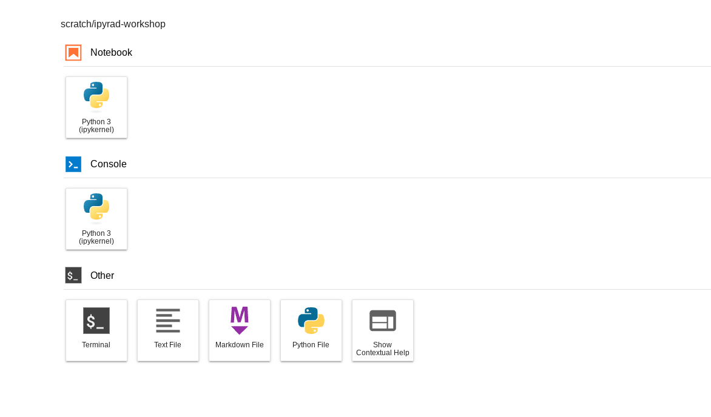
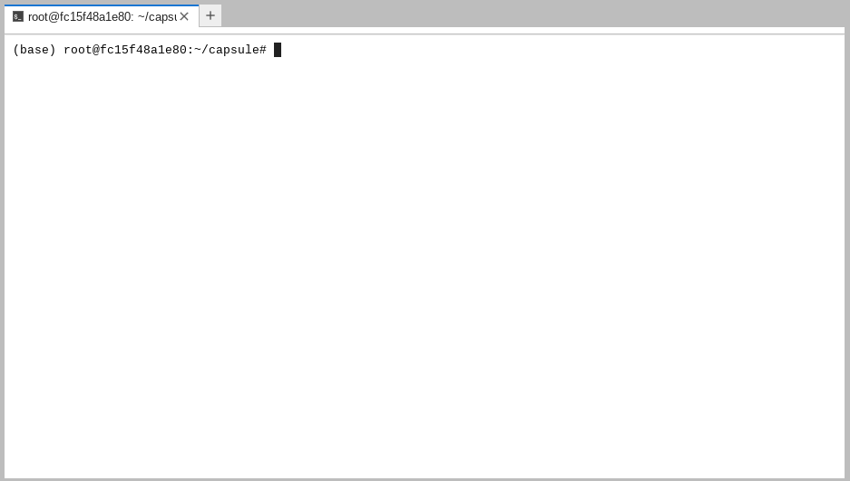

# RADCamp NYC 2023 Part II (Bioinformatics)
# Day 1 (AM)

## Overview of the morning activities:
* [Welcome and Introductions](#welcome-and-introductions)
* [Lecture: Intro to RADSeq (Brief)](#brief-intro-to-radseq)
* [Exercise 1: HPC systems, Linux/Bash, and the FASTQ data format](#intro-to-cli-and-fastq)
* Coffee Break (10:30-10:50)
* [Lecture: ipyrad history, philosophy and workflow](#ipyrad-history-philosophy-and-workflow)
* [Exercise 2: ipyrad CLI assembly of simulated data](#ipyrad-cli-simulated-data-assembly)
* Break for Lunch (12:45-1:30)

## Welcome and Introductions

[Instructor introduction slides](https://docs.google.com/presentation/d/1rOKSssEsz7TMOGMQAvOVx64nD8aAVuRj4dnB2WSbUmA/edit#slide=id.g25093f4cab7_0_13)

### Learning objectives.
By the end of this workshop you will gain experience with:
* More efficiently use tools for reproducible bioinformatics (unix, jupyter, ipyrad, CodeOcean, etc)
* Using HPC infrastructure to run genomic analyses
* Understanding how RAD sequence data is related to the methods we performed in the lab to create it
* Assembling a RAD-Seq dataset with ipyrad
* Understanding and dealing with missing data in RAD-seq analyses
* Running several evolutionary analysis tools on RAD-seq data


## Brief intro to RADSeq
Lead: Deren  
* Slides: [Introduction to RAD and the terminal](https://eaton-lab.org/slides/radcamp)  
* History of RAD-seq.  
* When to use RAD-seq and comparison to alternatives.  
* Brief introduction to the command-line and filesystems.  

## Intro to CLI and FASTQ
Lead: Isaac

* Genomics/Bioinformatics requires computing resources. Specifically, CPUs,
RAM, and a lot of disk space. Options: workstation, HPC, or cloud computing.
* A server is simply a program running on a remote (different) computer with
which you can interact over the internet. You send it instructions/code, it
runs the code and sends a response. This way you can use your laptop to run
very intensive code on a larger remote machine.
* For this workshop we are going to use compute infrastructure provided by
[CodeOcean](https://codeocean.com) which is a cloud platform for reproducible
data science. CodeOcean allows the creation of shareable, interactive,
and reproducible scientific computing workflows.

### Accessing a command line interface on CodeOcean
Our first goal will be to use a command line interface to view RAD-seq data
as way to become familiar with the format of the raw data that we will analyze, 
while also learning about basic command line programs. For this, we will connect
to CodeOcean as a remote server. For the moment, to stay focused
on the topic of RAD-seq and the ipyrad assembly process, we will pop right to 
the command line, but we will hear much more about the unique
features of the CodeOcean platform after lunch.

**Get everyone on CodeOcean here:**
* [Log in to the RADCamp CodeOcean instance (https://radcamp.codeocean.com/)](https://radcamp.codeocean.com/)
* On the landing page choose "New Capsule" and then "Create New"


* Select the "Ubuntu with ipyrad (0.9.92)" Environment
* Choose 'Select compute resources' and change it to 16 cores/128GB RAM


* Now we are going to "launch a cloud workstation" with JupyterLab enabled:


* A bunch of stuff happens with progress bars and moments later you will see
the 'JupyterLab' interface, which is our UI to the cloud computers provided by CO.
We will learn more about Jupyter notebooks later in the workshop, but for now
click on "Terminal" in the launcher window.


The commands you type in this terminal are not run on your own computer, they are
run on a 16 core virtual machine somewhere out in the ether:


### Navigating the command line
Each grey cell in this tutorial indicates a command line interaction.
Lines starting with `$ ` indicate a command that should be executed
in a terminal on the CodeOcean capsule, for example by copying and
pasting the text into your terminal. Elements in code cells surrounded
by angle brackets (e.g. <username>) are variables that need to be
replaced by the user. All lines in code cells beginning with \#\# are
comments and should not be copied and executed. All other lines should
be interpreted as output from the issued commands.

```bash
## Example Code Cell.
## Create an empty file in my home directory called `watdo.txt`
$ touch ~/watdo.txt

## Print "wat" to the screen
$ echo "wat"
wat
```

Here we'll use bash commands and command line arguments. If you have trouble
remembering the different commands, you can find some very useful commands on
this [cheat sheet](https://www.git-tower.com/blog/command-line-cheat-sheet/).
Take a look at the contents of the folder you're currently in.
```bash
$ ls
```

There are a bunch of folders. To keep things organized, we will create a new
directory which we'll be using during this Workshop. Use `mkdir`. And then
navigate into the new folder, using `cd`.
```bash
$ cd /scratch
$ mkdir ipyrad-workshop
$ cd ipyrad-workshop
```

* Unix tools: cd, ls, less, cat, nano, grep.

**NB:** A word about the behavoir of different CO directories.

### First view of FASTQ data
Goals of this module:
* View and understand the fastq format
* Understand how the RADseq fastq data is related to the 3RAD molecular protocol?
See: [“How to add PCR duplicate identifier”](https://docs.google.com/presentation/d/1Tvw5m4Y33aHe1ItiHSA7LXV3y3k0BGQj3HwlIIfDE_0/edit#slide=id.p)
* Be able to locate the restriction enzyme recognition sequence, the i7, and
inline barcodes on R1 and R2 files.

For this exercise we will use one sample from an Amaranthus dataset
which is also 3RAD. We will download some of these data, using the command `wget`.
Make sure that you are in the ipyrad-workshop folder you just created. Since
this is paired end data, you'll need to grab both R1 and R2 files.

```bash
$ wget wget https://github.com/radcamp/radcamp.github.io/raw/master/NYC2023/datafiles/Amaranthus_R1_.fastq.gz 
$ wget wget https://github.com/radcamp/radcamp.github.io/raw/master/NYC2023/datafiles/Amaranthus_R2_.fastq.gz
```

Now, we will use the `zcat` command to read lines of data from this file and
we will trim this to print only the first 20 lines by piping the output to the
`head` command. Using a pipe (|) like this passes the output from one command to
another and is a common trick in the command line.

Here we have our first look at a **fastq formatted file**. Each sequenced
read is spread over four lines, one of which contains sequence and another
the quality scores stored as ASCII characters. The other two lines are used
as headers to store information about the read.

```bash
$ zcat Amaranthus_R1_.fastq.gz | head -n 20
@NB551405:60:H7T2GAFXY:1:11101:24090:2248 1:N:0:TATCGGTC+CAACCGGG
TTAGGCAATCGGTTATGAGGTTTACGAACAGGTTAAAGGAGTTGAAACTATATTTGGTAAAACAGGACAAGTGCAAGGGG
+
AAAAAEEEEE/EEEAE/AEEEEEEEEEEEEEEEE/EEEEEEEEEAEEEEEEA/EEE<E/EEAEE<EEEEEEEEEEEE<AE
@NB551405:60:H7T2GAFXY:1:11101:4371:2248 1:N:0:TATCGGTC+GTACCAAA
AACTCGTCATCGGCTACATGTGCTATTATCATTGCCATTTATTCTCCTTGAAGTGCACAAACCAGATTGTCTTGTGCTTA
+
AAA/AAAEEEEEEEEEEEEEEEEEEEEEEEEEEEEEEAEEEEEEEEAE<EEEAEEEAE/EAEAEE/EAEEEEEEEEEEEE
@NB551405:60:H7T2GAFXY:1:11101:6626:2248 1:N:0:AACCTCCT+CAGGTGAA
GGTCTACGTATCGGCCTCCATCCGATTCTGTTGTTGGTACTTTGACTTTCATTGTCACGTTTTAAAACTTTGACCACTAT
+
AAAAAEEEEEEEEEEEEEEE/EEEEEEEEEEEEEEEEEEEEEEEEEEEEEEEEEEEEEEEEEEEEEEEEEEEAEEEEEEE
@NB551405:60:H7T2GAFXY:1:11101:18661:2248 1:N:0:AAGTCGAG+GGCGATAA
GGTCTACGTATCGGGCCTAGATTTCCCTAGTTAACAATGGTGGAATGAAATTGAATTGATTAAGCAGGAGGAAAAGGATG
+
AAAAAEEEEEEEEEEEEEEEEEEEEEEEEEEEEEEEEEEEEEEEEEEEAEEEEEEEEEEEEEEEEEEEEEEEEEEEEEEE
@NB551405:60:H7T2GAFXY:1:11101:18275:2248 1:N:0:CATTCGGT+AACACAGG
TCATGGTCAATCGGTTCATGCTAAACACAATTTCAGAAGTAGCTGTTGAAAGAAGATACATAAAATATAATAGAGATACA
+
/AAA//EAEE/EEEEEEEEE/EEEEEE<EEEEAEEAEEEEEAEEAEEAEEEEEEEEEEEEEAEEEEEAEE<AEEEEEEAE
```

The first is the name of the read (its location on the plate). The second line
contains the sequence data. The third line is unused. And the fourth line is the
quality scores for the base calls. The [FASTQ wikipedia](https://en.wikipedia.org/wiki/FASTQ_format)
page has a good figure depicting the logic behind how quality scores are encoded.

The pair of sequences at the end of each header line (TATCGGTC+CAACCGGG) are
Illumina's i7 and i5 read sequences.  The libraries you created/will be
analyzing used the i7 as the participant identifier and the i5 as the PCR
duplicate identifier (unique molecular index).  So you should see the same i7
across all reads in your fastq file but different i5 sequences across different
reads of the fastq file.

A few activities to work through on your own (or in small groups)
* In this data the restriction enzyme leaves a ATCGG overhang. Can you find this
sequence in the raw data?
* Why is the overhang sequence not right at the beginning of the R1 reads? What is that other stuff?
* Use zcat and head to view the first 20 lines of R2. See if you can figure out what the overhang sequence is in R2.

## Coffee break (10:30-10:50)

## ipyrad history, philosophy, and workflow
Lead: Deren
* [ipyrad documentation](https://ipyrad.readthedocs.io/en/latest/)

## ipyrad CLI simulated data assembly
Lead: Isaac

[Exercise: ipyrad command line assembly with simulated data](ipyrad-CLI-FullTutorial.html)


## Break for lunch (12:45-1:30)
