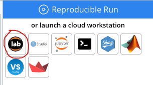

# RADCamp NYC 2023 Part II (Bioinformatics)
# Day 1 (AM)

## Overview of the morning activities:
* [Welcome and Introductions](#welcome-and-introductions)
* [Lecture: Intro to RADSeq (Brief)](#brief-intro-to-radseq)
* [Exercise 1: HPC systems, Linux/Bash, and the FASTQ data format](#intro-to-cli-and-fastq)
* Coffee Break (10:30-10:50)
* [Lecture: ipyrad history, philosophy and workflow](#ipyrad-history-philosophy-and-workflow)
* [Exercise 2: ipyrad CLI assembly of simulated data](#ipyrad-cli-simulated-data-assembly)
* Break for Lunch (12:45-1:30)

## Welcome and Introductions

### Learning objectives.
By the end of this workshop you will gain experience with:
* Basic bioinformatics skills
* Using HPC infrastructure to run genomic analyses
* Understanding how RAD sequence data is related to the methods we performed in the lab to create it
* Assembling a RAD-Seq dataset with ipyrad
* Understanding and dealing with missing data in RAD-seq analyses
* Running several evolutionary analysis tools on RAD-seq data

## Brief intro to RADSeq
Lead: Deren
[Introduction to RAD and the terminal](https://eaton-lab.org/slides/radcamp)

## Intro to CLI and FASTQ
Lead: Isaac

* Genomics/Bioinformatics requires computing resources. Specifically, CPUs,
RAM, and a lot of disk space. Options: workstation, HPC, or cloud computing.
* A server is simply a program running on a remote (different) computer with
which you can interact over the internet. You send it instructions/code, it
runs the code and sends a response. This way you can use your laptop to run
very intensive code on a larger remote machine.
* For this workshop we are going to use compute infrastructure provided by
[CodeOcean](https://codeocean.com) which is a cloud platform for reproducible
data science. CodeOcean allows the creation of shareable, interactive,
and reproducible scientific computing workflows.

### Accessing a command line interface on CodeOcean
We will perform the basic assembly and analysis of simulated RADSeq data using a
command line interface on a CodeOcean 'capsule'. For the moment, to stay focused
on the details of the ipyrad assembly process, we will pop right to the command
line (using the following procedure), but we will hear much more about the unique
features of CodeOcean after lunch.

**Get everyone on CodeOcean here:**
* [Log in to the RADCamp CodeOcean instance (https://radcamp.codeocean.com/)](https://radcamp.codeocean.com/)
* On the landing page choose "New Capsule" and then "Create New"

* Select the "Ubuntu with ipyrad (0.9.92)" Environment
* Choose 'Select compute resources' and change it to 16 cores/128GB RAM

* Now we are going to "launch a cloud workstation" with JupyterLab enabled:

* A bunch of stuff happens with progress bars and moments later you will see
the 'JupyterLab' interface, which is our UI to the cloud computers provided by CO.
We will learn more about Jupyter notebooks later in the workshop, but for now
click on "Terminal" in the launcher window. The commands you type in this
terminal are not run on your own computer, they are run on a 16 core virtual
machine somewhere out in the ether:

### Navigating the command line
Bash basics on CodeOcean
* Unix tools: cd, ls, less, cat, nano, grep.

**NB:** A word about the behavoir of different CO directories.

### First view of FASTQ data
* Describe fastq format.
* Format of RAD-seq (3RAD) fastqs before and after i7 and barcode demux
* How is the RAD-seq format related to the 3RAD molecular protocol? Show image of the “How to add PCR duplicate identifier” slide from part I. 
* View/highlight RE, i7, and inline barcodes on R1 and R2 files. Play the
"Why is this the restriction overhang floating out there?" game.

## Coffee break (20 minutes)

## ipyrad history, philosophy, and workflow
Lead: Deren
* [ipyrad documentation](https://ipyrad.readthedocs.io/en/latest/)

## ipyrad CLI simulated data assembly
Lead: Isaac

[ipyrad CLI Part I](Part_II_files/ipyrad_partI_CLI.html)
[ipyrad CLI Part II](Part_II_files/ipyrad_partII_CLI.md)

## Break for lunch
