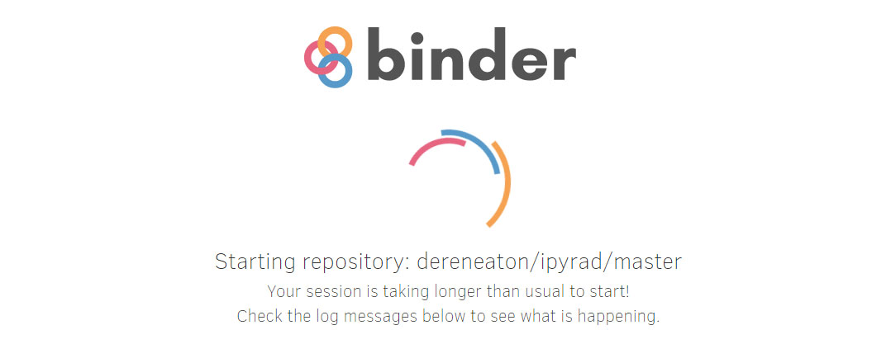

# RADCamp NYC 2023 Part II (Bioinformatics)
# Day 1 (AM)

## Overview of the morning activities:
* [Welcome and participant intro slides](#participant-intros-part-I)
* [Intro to RADSeq (Brief)](#brief-intro-to-RADSeq)
* [Intro to ipyrad documentation](#intro-ipyrad-docs)
* [Connect to a binder instance](#intro-to-binder)
* [ipyrad CLI assembly of simulated data Part I](#ipyrad-cli-simulated-data-assembly-part-I)
* [ipyrad CLI assembly of simulated data Part II](#ipyrad-cli-simulated-data-assembly-part-II)

## Participant intros part I
[1 minute/1 slide participant intros](https://docs.google.com/presentation/d/1EtEWfwzOA7u4mEZMxnzgsXZO_6DvZStA2ON8GQkWb6w/edit?usp=sharing)

## Brief intro to RADSeq
Lead: Deren
[Introduction to RAD and the terminal](https://eaton-lab.org/slides/radcamp)

## Intro ipyrad docs
[ipyrad documentation](https://ipyrad.readthedocs.io/en/latest/)

## Intro to binder
We will perform the basic assembly and analysis of simulated data using
[binder](https://mybinder.org/), to launch a working copy of the ipyrad github
repository. The binder project allows the creation of shareable, interactive,
and reproducible environments by facilitating execution of jupyter notebooks
in a simple, web-based format. More information about the binder project is
available in the [binder documentation](https://mybinder.readthedocs.io/en/latest/introduction.html).

**NB:** The binder instance we will use here for the first day is a service
to the community provided by the binder project, so it has limited computational
capacity. This capacity is sufficient to assemble the very small simulated
datasets we provide as examples, but it is in no way capable of assembling
real data, so don't even think about it! We use binder here as a quick and
easy way of demonstrating workflows and API mode interactions without all the
hassle of going through the installation in a live environment. When you
return to your home institution, if you wish to use ipyrad we provide
[extensive documentation for setup and config for both local installs
and installs on HPC systems](https://ipyrad.readthedocs.io/en/latest/3-installation.html).

**NB:** Binder images are transient! Nothing you do inside this instance will
be saved if you close your browser tab, so don't expect any results to be
persistent. Save anything you generate here that you want to keep to your local
machine.

**Get everyone on binder here:** [Launch ipyrad with binder.](https://mybinder.org/v2/gh/dereneaton/ipyrad/master?filepath=newdocs%2FAPI-analysis)

Have patience, this could take a few moments.
If it's ready, it should look like this:

To start the terminal on the jupyter dashboard, choose New>Terminal.

## ipyrad CLI simulated data assembly Part I
Lead: Isaac

[ipyrad CLI Part I](Part_II_files/ipyrad_partI_CLI.html)

## ipyrad CLI simulated data assembly Part II
Lead: Isaac

[ipyrad CLI Part II](Part_II_files/ipyrad_partII_CLI.md)

## Break for lunch
